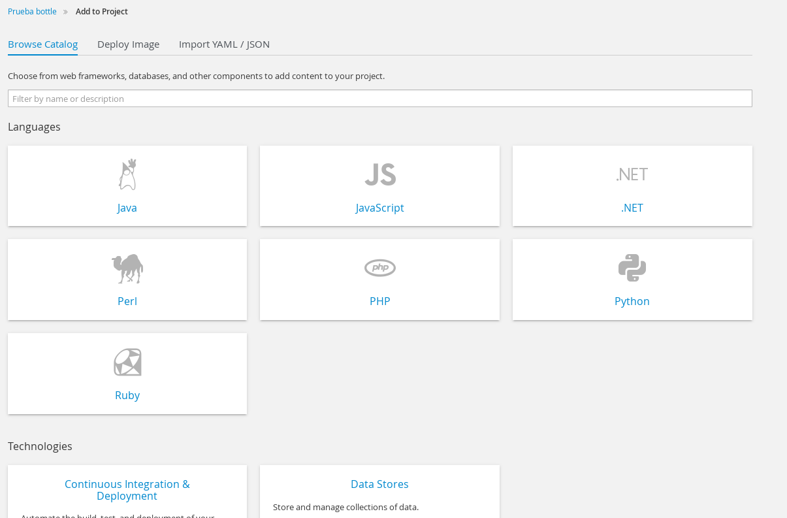

# Introducción a openshift 3

Openshift 3 es un PaaS que utiliza contenedores (docker y kebernetes) para la construcción, ejecución y despliegue de aplicaciones. 

Entre sus características podemos destacar las siguientes:

* Portabilidad de las aplicaciones: al estar construido en base a contenedores con Docker, esto permite que nuestra aplicación sea migrada a cualquier sistema que utilice Docker.
* OpenSource: con todas las posibilidades y ventajas que el software libre nos proporciona.
* Escalable: permite que las aplicaciones escalen de forma sencilla y automática.
* Multilenguaje: permite la utilización de diferentes lenguajes, plataformas, bases de datos... permitiendo a los desarrolladores utilizar todas las posibilidades de Docker.
* Automatización: Openshift automatiza la construcción de tu aplicación, su despliegue, su escalado, la gestión de estado...

## Conceptos básicos

* **Proyecto**: es la unidad de agrupación de aplicaciones, permisos...
* **Servicio (services)**: cada servicio representa a cada una de las aplicaciones que tengamos en nuestro proyecto, el servicio será el punto de entrada a la aplicación y expondrá unos puertos para su comunicación. 
* **Ruta (routes)**: la ruta es la URL asociada a un servicio para que podamos invocarlo, una ruta puede estar abierta a Internet o ser solo de uso interno. 
* **Despliegue (deployments)**: representa la configuración de despliegue para esa aplicación, en ella se indica el número de instancias, su configuración, qué imagen de contenedor utilizar, parámetros de escalado... 
* Pod: cada instancia que deseemos ejecutar de nuestra aplicación se ejecutará en un pod diferente.
* **Build**: Es un recurso que nos permite crear los despliegues, servicios y rutas correspondientes a una aplicación, a partir de tres mecanismos:

    * Source-to-Image (S2I): es un framework que permite, tomando el código fuente de tu aplicación como entrada, generar una imagen que ejecuta dicho código fuente. Así se creará una imagen Docker por cada versión de tu código fuente que desees ejecutar.
    * Docker build: esta estrategia ejecutará un "Docker build" y esperará a que se genere la imagen Docker en el registry para utilizarla.
    * Estrategia personalizada: esta estrategia consiste en que tú mismo crees una imagen Docker que lo que haga sea precisamente ejecutar el proceso de construcción de tu aplicación en otra imagen, que será la que se despliegue.

## Construcción de una aplicación con Web Console

Vamos a desplegar una aplicación bottle python que podemos ver en [https://github.com/josedom24/bottle_openshift_v3](https://github.com/josedom24/bottle_openshift_v3).

Añadimos un proyecto, le ponemos un nombre, y a continuación elegimos la estrategia de "build", en nuestro caso S2I, por lo que en el catalogo de imágenes escogemos python 2.7.

A continuación nombremos el "build" que estamos configurando, indicando también la URL del repositorio GitHub donde se encuentra la aplicación a desplegar.

Una vez que hemos accedido al dashboard observamos que se ha comenzado a realizar un "build", una vez terminado creara el deployment, service y route correspondiente a la aplicación con lo que tendremos un pod ejecutándose.

Si cambiamos el código de nuestra aplicación, tendremos que crear un nuevo build para que se cree una nueva imagen que sea desplegada.

Por último accediendo a la ruta generada para nuestro proyecto accedemos a la aplicación:

